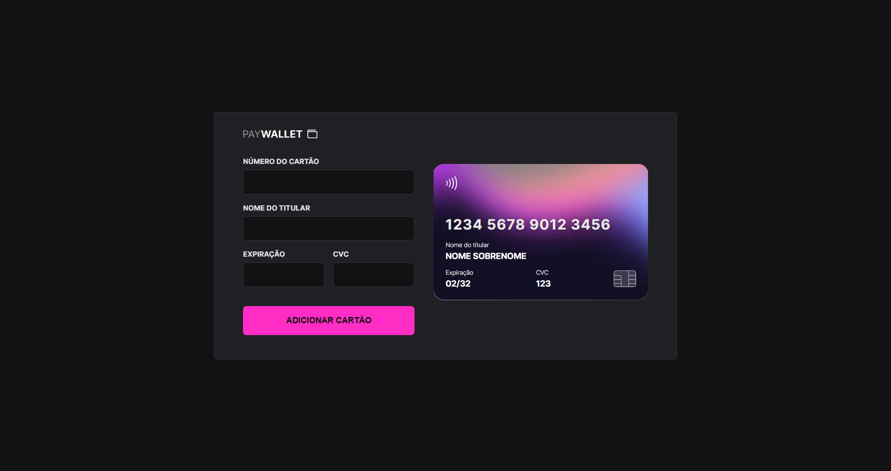

<h1 align="center"> Explorer Lab #01 </h1>

>PT-BR  
Site criado durante o evento [Explorer Lab](https://app.rocketseat.com.br/event/explorer-lab/explorer/), promovido pela [Rocketseat](https://app.rocketseat.com.br/).
>EN-US  
Website created during [Rocketseat](https://app.rocketseat.com.br/)'s [Explorer Lab](https://app.rocketseat.com.br/event/explorer-lab/explorer/) event.

  <a href="#-languages">Languages</a>&nbsp;&nbsp;&nbsp;|&nbsp;&nbsp;&nbsp;
  <a href="#-about">About</a>&nbsp;&nbsp;&nbsp;|&nbsp;&nbsp;&nbsp;
  <a href="#-layout">Layout</a>&nbsp;&nbsp;&nbsp;|&nbsp;&nbsp;&nbsp;

 

  

## 🚀 Languages

- HTML, CSS
- JavaScript, JSON
- [Node, NPM](https://nodejs.org/)
- [Vite](https://vitejs.dev/)
- [iMask](https://imask.js.org)

## 💻 About

This form simulates a credit card paying platform that automatically updates as you input your info.